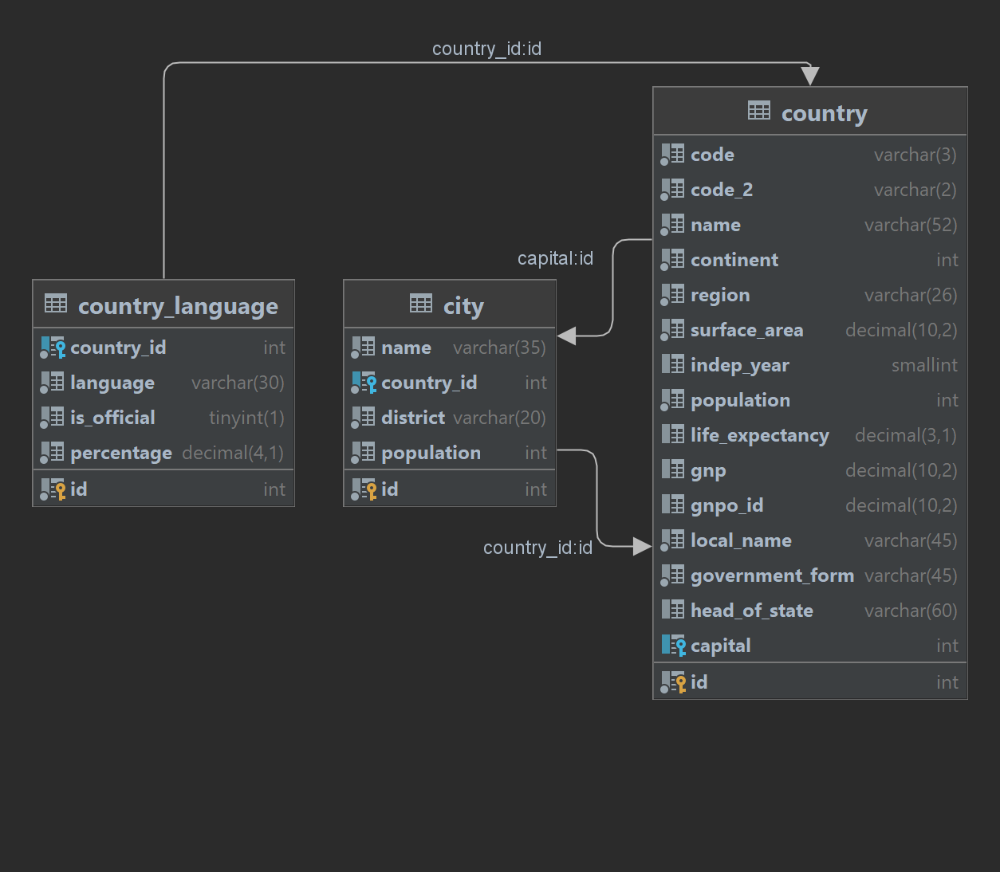

# Project: SQL, JDBC и Hibernate
final project for fourth modul
## Technologies:
Java, Maven, MySQL, Hibernate, p6spy, Redis, Docker, Junit, Log4j 2

<!--Installation-->
## Soft
1. IDEA Ultimate
2. Workbench (or other MySQL)
3. Docker
4. redis-insight – optional (http://localhost:8001/redis-stack/browser)

## Installation
1. Setup Docker.
2. Start MySQL Server as  Docker-container:
   - docker run -d --name mysql -e MYSQL_ROOT_PASSWORD=root -v C:\docker:/var/lib/mysql -p 3306:3306 mysql:8.0
3. Open [dump-file](./dump-hibernate-final.sql) and deploy it.
4. Create new project in Idea  
5. This is Maven project with all necessary dependencies (hibernate-core-jakarta, mysql-connector-java, p6spy, lettuce-core, jackson-databind).
6. Connect DB in idea. Schema world.
7. Start Redis serer as Docker-container:
   docker run -d --name redis-stack -p 6379:6379 -p 8001:8001 redis/redis-stack:latest
8. After start, you can show list of a started containers . For that run this command:
docker container ls
9. Test the speed of receiving  same data from  MySQL and Redis possible in Main and MainTest. 
10. Schema looks like:

